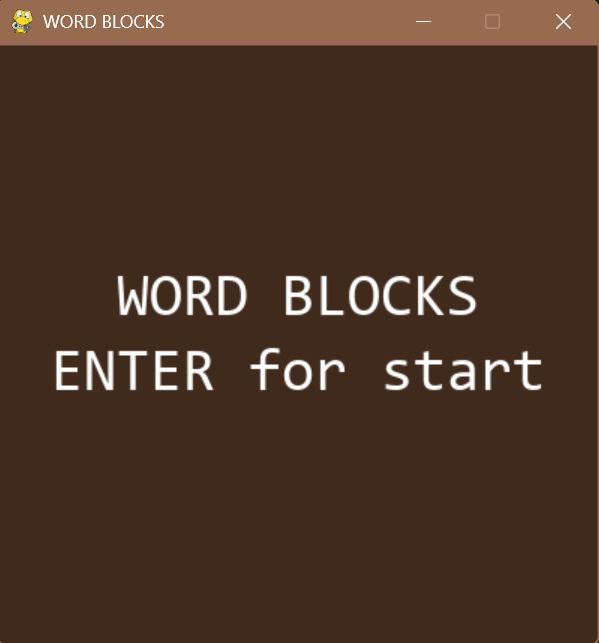
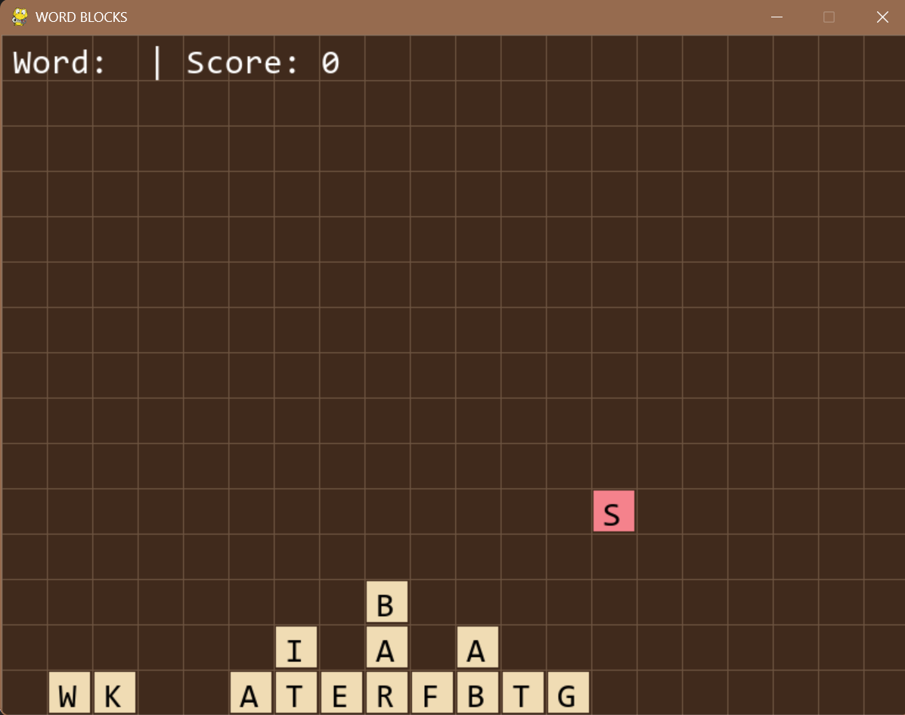
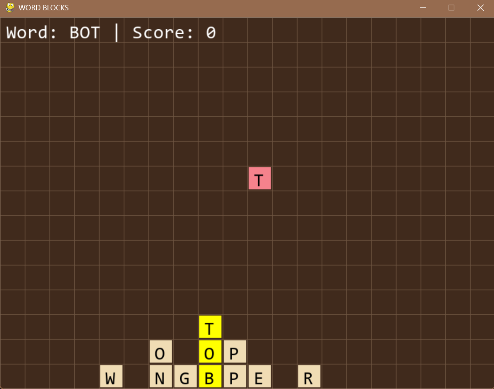
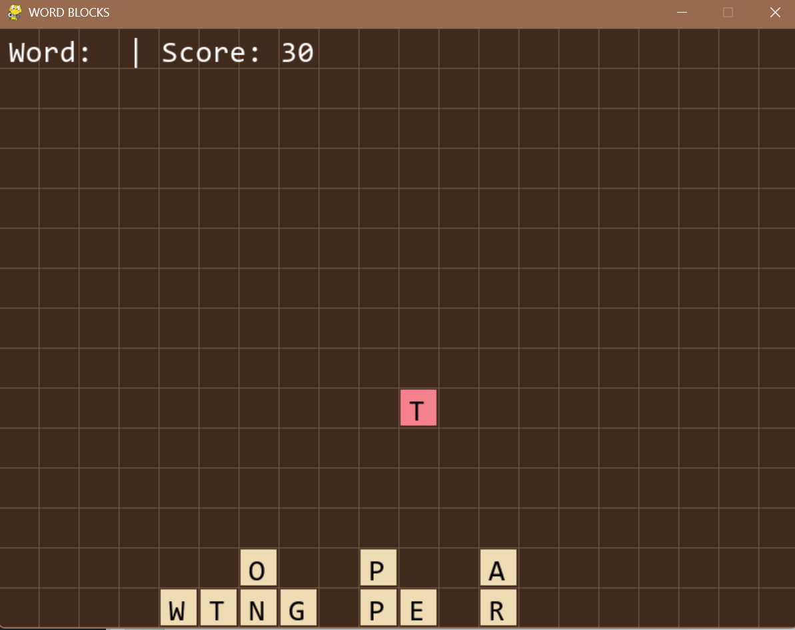
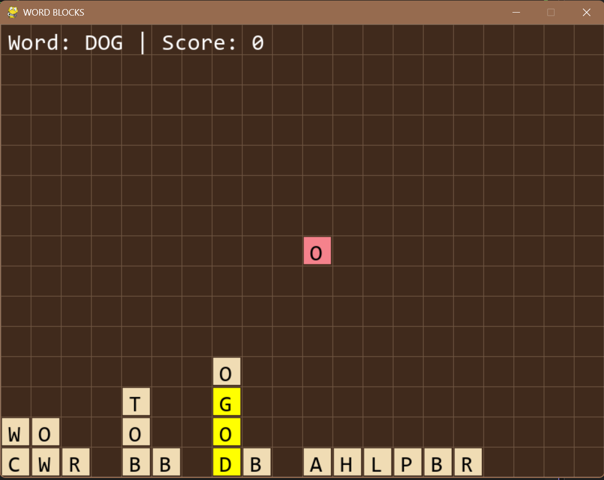
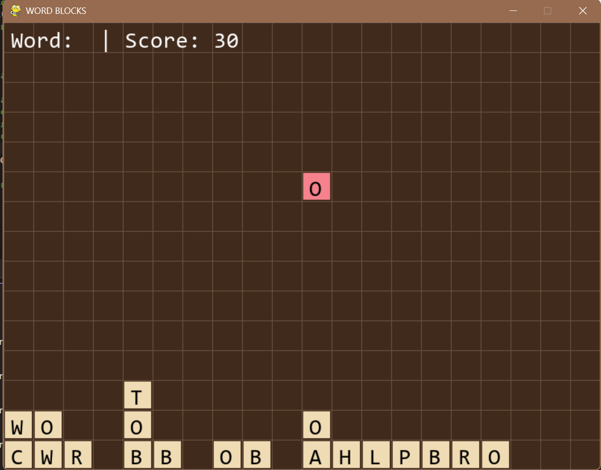
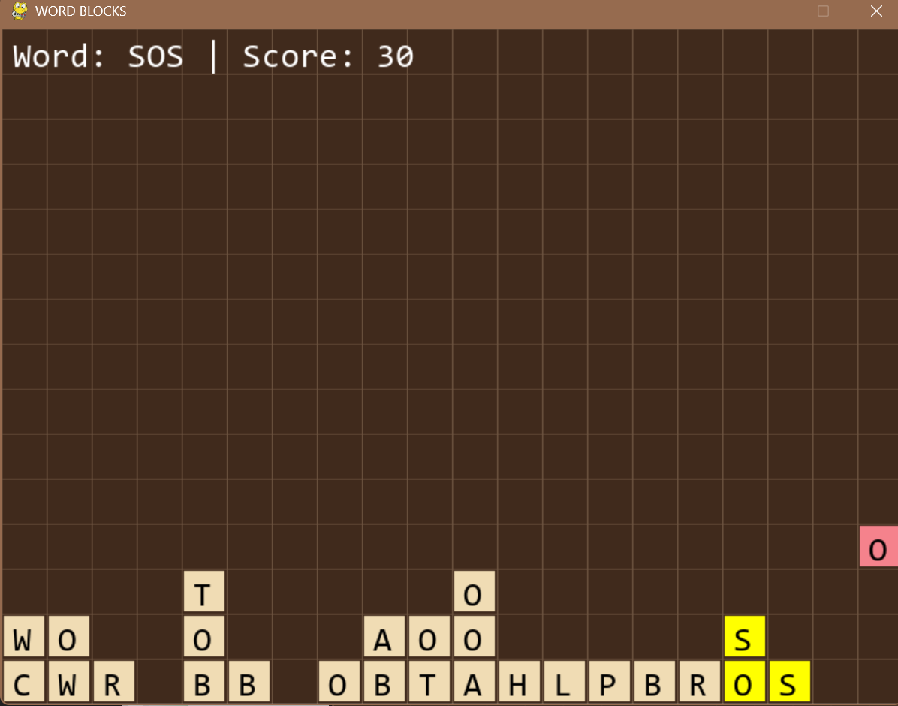
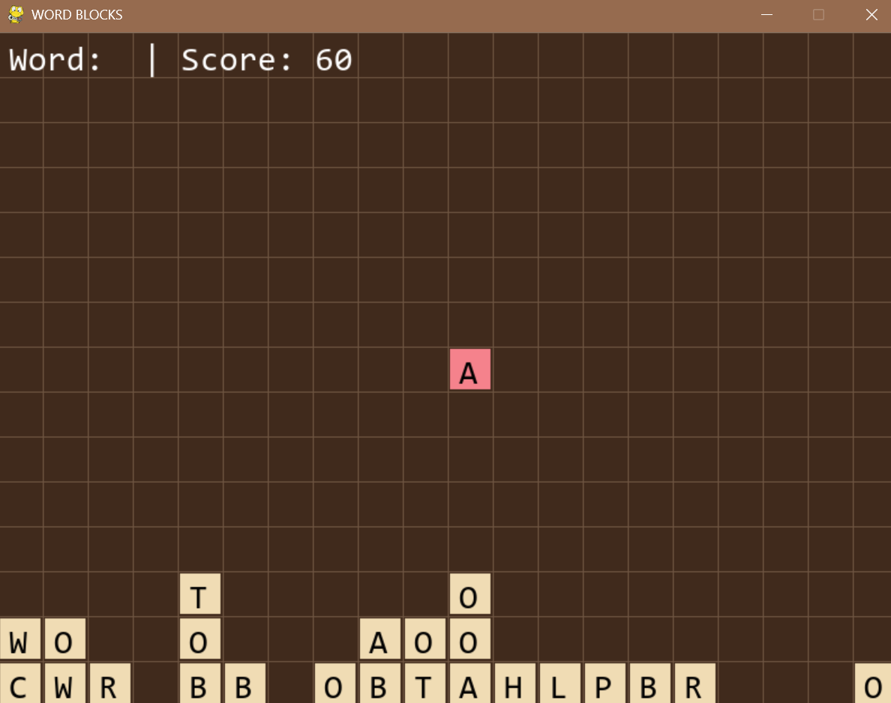
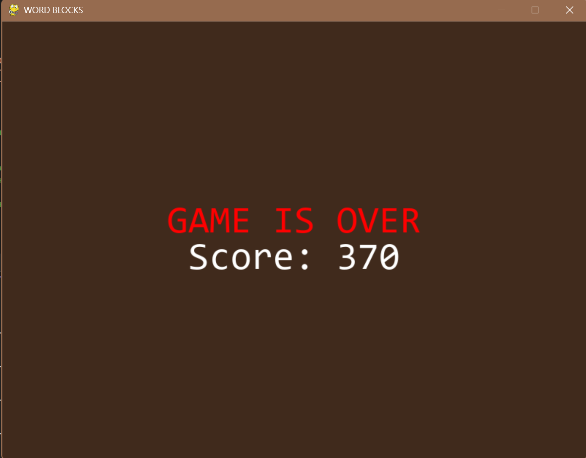

# Word Blocks (Словесный Тетрис)

Игра-головоломка на Python + Pygame. Сверху падают блоки с буквами, игрок собирает из них слова, кликая по соседним буквам.

## Стек технологий

- Python 3.9+
- Pygame 2.6.1 — графика, обработка ввода, отрисовка

## Структура проекта

word_blocks/
├── main.py
├── constants.py
├── block.py
├── game.py
├── README.md
├── .gitignore
└── screenshots/

## Запуск игры

python main.py

## Управление

- Стрелки ← → — движение падающего блока
- Стрелка ↓ — ускорить падение
- Enter — проверить собранное слово
- Клик мыши — выделить букву
- Пробел — начать игру из меню

## Механики игры

1. Падение блоков — блоки падают сверху, пока не упрутся в дно или другой блок.
2. Сбор слов — игрок кликает по упавшим буквам, выделяя соседние (по вертикали или горизонтали).
3. Проверка слова — по Enter слово проверяется по словарю. Если верное — буквы удаляются, верхние сдвигаются вниз.
4. Проигрыш — если новому блоку не хватает места на верхней строке.

## Частота букв

Алгоритм генерации букв учитывает словарь VALID_WORDS. Каждая буква повторяется столько раз, сколько встречается в словах. Гласные выпадают чаще. Буквы, которых нет в словаре (Q, X, Z), не появляются.

## Скриншоты

1. Стартовый экран

2. Игровой процесс

3. Слово в столбик — выделение

4. Слово в столбик — исчезло

5. Столбик с падающей буквой сверху — выделение

6. Столбик с падающей буквой сверху — исчезло

7. Слово уголком — выделение

8. Слово уголком — исчезло

9. Экран проигрыша

## Зависимости

Проверить Pygame:

python -c "import pygame; print(pygame.__version__)"

Установить Pygame:

pip install pygame

## Автор

Студент: Койро Мария
Группа: 25-СТ
Год: 2026